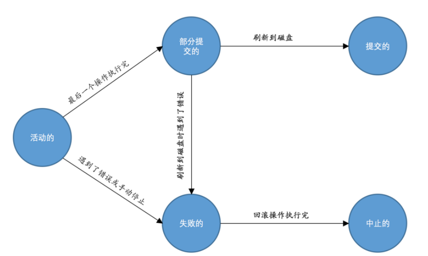

# Buffer pool

# 事务
在buffer pool一章中，对某个页面进行读写访问的时候，都会先把这个页面加载到buffer pool中，之后如果修改了某个页面，也不会立即把修改刷新到磁盘中。
而只是把这个修改后的页面添加到buffer pool的flush链表中，之后再某个时间点再进行刷新到磁盘。  

事务其实是个抽象的概念，其实对应着一个或者多个数据库操作。  
需要保证原子性，隔离性，一致性和持久性的一个或多个数据库操作称为事务。
事务问题
经典的转账问题：
A需要向B借钱 100元
需要完成  
A的数据库中金额少100元，B的数据库中金额多100元，相当于两条sql语句。需要保证两条数据要么执行都不成功，要么都执行成功。   
为了完成这种现实生活中的问题，mysql需要遵循一些原则：
原子性

## 原子性 atomicity:
一个事务必须被视为一个不可分割的最小工作单元，整个事务中的所有操作要么全部提交成功，要么全部失败回滚。
## 一致性 consistency ：
数据库总是从一个一致性，转换到另一个一致性的状态。（这句话太鬼扯）  
如果数据库中的数据全部符合现实世界中的约束，我们就说这些数据就是一致的，或者说符合一致性的。
数据库本身可以为我们解决一部分一致性要求-例如唯一索引，自己定义触发器  
业务程序业务代码保证
## 隔离性  isolation：
一个事务所做的修改在最终提交以前，对其他事务时不可见的。
## 持久性 durability：
一旦事务提交，则其所作的修改就会被永久的保存到数据库中。  
（这个概念其实很模糊，因为实际持久性也分很多不同的级别，有些持久性策略能够提供非常强的安全保障，而有些未必。并且不可能有能做到100%的持久性保证的策略）
事务的状态

并不是所有的存储引擎都支持事务，目前mysql中InnoDB支持和NDB支持。在不支持事务的存储引擎中，是没有办法回滚的rollback
事务的自动提交 autocommit，默认开启，开启的时候，每个sql都算是一个独立的事务。

## 隐式提交：  

如果我们输入了某些语句，且这些语句会导致之前的事务悄悄地提交掉，那么这种情况我们称之为隐式提交。
* DDL:create alter drop修改数据库对象的时候
* 隐式的使用或修改mysql数据库中的表
* 事务控制或关于锁定的语句：当一个事务还没有提交或者回滚的时候又使用START TRANSACTION或者BEGIN语句开启了另一个事务，此时会隐式地提交上一个事务。
## 保存点
* 在事务过程中的一个打点，可以rollback到指定打点的地方，而不用回滚整个sql语句
# redo 日志

我们进行的增删改查操作本质上就是在访问页面，在真正访问也买你之前，需要把在磁盘中的页加载到内存中的buffer pool中，才可以访问。
1. 刷新 一个完整的数据页太浪费了
2. 随机I/O刷新起来速度较慢，利用buffer pool刷新的到磁盘，需要进行很多的随机I/O

redo log 重做日志 本质是记录了事务对数据库进行了哪些修改。
例如 `将第0号表空间的100号页面的偏移量为1000处的值更新为 2 `。   
提交事务同时，将上述内容刷新到磁盘中。
redo日志所占空间小，顺序写入磁盘

